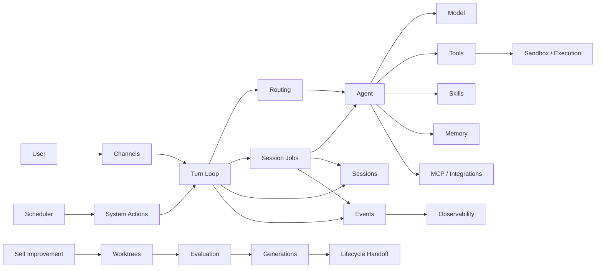

<p align="center">
  
</p>

<h1 align="center">F.R.I.D.A.Y</h1>

<p align="center">
  <strong>The secure self-improving personal AI agent — local-first, self-hosted, with persistent memory, tools, voice, MCP, automation, and verified self-extension.</strong>
</p>

<p align="center"><em>Built to work for you. Built to get better.</em></p>

<p align="center">
  <a href="https://github.com/saravanaspar/F.R.I.D.A.Y/actions/workflows/ci.yml"></a>
  <a href="https://github.com/saravanaspar/F.R.I.D.A.Y/releases"></a>
  <a href="LICENSE"></a>
  
  <a href="CONTRIBUTING.md"></a>
</p>

<p align="center">
  <a href="#quick-start">Quick start</a> &middot;
  <a href="#what-friday-can-do">Capabilities</a> &middot;
  <a href="#how-it-fits-together">Architecture</a> &middot;
  <a href="#channels">Channels</a> &middot;
  <a href="#durability-and-recovery">Recovery</a> &middot;
  <a href="#development">Development</a> &middot;
  <a href="#contributing">Contribute</a>
</p>

---

## Meet F.R.I.D.A.Y

F.R.I.D.A.Y is a local-first, self-hosted personal AI agent designed to behave less like a one-shot chatbot and more like a long-lived assistant that stays useful across projects, devices, sessions, and restarts.

It combines a plugin-first agent runtime with durable sessions and background jobs, persistent memory, scheduling, multi-channel messaging, secure tool execution, MCP integrations, encrypted secrets, observability, and a verified self-improvement/restart path.

The self-improvement path is reuse-first: F.R.I.D.A.Y inspects existing tools, actions, typed plugin capabilities, contribution instances, and MCP options before deciding new code is necessary. When code is required, changes are isolated, evaluated, verified, promoted, and handed off through explicit lifecycle boundaries instead of treating the running system as an unrestricted rewrite target.

You can talk to the same agent from a configured messaging channel, give it work that takes time, continue doing something else, come back later, schedule future work in your own timezone, or ask it to extend a missing capability when the runtime can safely build and verify one.

> [!IMPORTANT]
> F.R.I.D.A.Y can execute code, invoke tools, communicate with external services, and mutate files when permitted. Treat it like powerful local automation software: review permissions, use sandboxing where appropriate, protect credentials, and do not expose trusted channels to untrusted users.

## Why F.R.I.D.A.Y is different

- **Self-improving, not self-rewriting by default.** Reuse and capability discovery come first; verified self-extension is a bounded fallback when an explicitly requested capability is actually missing.
- **Plugin-native and machine-discoverable.** Typed capabilities, contributions, hooks, and concrete contribution instances are discoverable from the real plugin contracts/registrations rather than a manually maintained feature catalog.
- **Local-first and self-hosted.** Runtime state, durable sessions, memory, tools, and operator controls live under your installation rather than requiring a hosted assistant service.
- **Security is part of the architecture.** Vault, permissions, sandboxing, trusted channel principals, typed authority boundaries, verification, rollback, and authenticated lifecycle handoff are designed into the runtime.

## What F.R.I.D.A.Y can do

| Capability | What it means |
| --- | --- |
| Personal assistant | Maintains useful context across conversations, sessions, projects, and durable memory. |
| Long-running work | Runs persistent session jobs without forcing one conversation to wait for another task. |
| Coding and automation | Uses execution tools, files, processes, sandboxes, integrations, and model-driven workflows. |
| Multi-channel access | Receives and replies through Telegram, Discord, Slack, WhatsApp, Signal, Email, Teams, Google Chat, and SMS/Twilio. |
| Voice | Optional speech-to-text and text-to-speech through OpenAI, Deepgram STT, or ElevenLabs TTS; audio transcripts enter the same Turn Loop as text while remaining explicitly untrusted user content. |
| Conditional hooks | Persists user-scoped conditions/instructions for turn, action, or handover phases with bounded invocation counts. |
| Scheduling | Stores durable one-shot and recurring schedules in the user's configured IANA timezone. |
| Memory | Keeps bounded preferences, habits, and graph-like relationships without stuffing the full history into every prompt. |
| Skills | Installs and creates reusable skills that can be surfaced to the agent when relevant. |
| MCP and integrations | Connects external tools and services through permission-gated capability boundaries. |
| Secure secrets | Stores credentials in an encrypted Vault instead of plaintext runtime configuration. |
| Sandboxed execution | Uses a pluggable sandbox-provider contract; kern is the built-in default, while other providers can be registered without changing tools or execution policy. |
| Crash recovery | Writes secret-redacted crash records and supports supervised automatic restart. |
| Self-extension | Can feasibility-check, build, evaluate, promote, restart, and resume after adding a missing software capability. |

<details>
<summary><strong>What "self-extension" means</strong></summary>

F.R.I.D.A.Y does not blindly rewrite itself after every conversation. When an explicitly requested capability is missing, the self-improvement path can:

1. inspect installed actions/tools and capability contracts before choosing new code;
2. for external/tool integrations, search configured MCP servers and the official MCP Registry, then accept MCP only after a live tool description/input-schema check verifies the exact requested operation;
3. determine whether any genuinely missing capability is feasible and choose the owning code placement only after MCP-first discovery finds no exact live match;
4. request explicit authorization before making code changes;
5. create changes in an isolated worktree only when code is actually required;
6. run quality/evaluation gates;
7. promote a verified generation;
8. perform an authenticated two-process handoff; and
9. resume the original request after the successor is ready.

When an existing action, tool, or typed capability already solves the request—or an MCP candidate has been live-verified for the exact operation—F.R.I.D.A.Y avoids the code-generation/restart path. Registry names/descriptions alone are never treated as proof that an MCP can do the job.

If other foreground turns or background jobs are active at restart time, F.R.I.D.A.Y asks before pausing them and explains the recovery boundary.

</details>

## Quick start

### Install the latest release

On Linux or macOS:

```bash
tmp="$(mktemp)"
curl --proto '=https' --tlsv1.2 -fsSL \
  https://github.com/saravanaspar/F.R.I.D.A.Y/releases/latest/download/install-release.sh \
  -o "$tmp"
gh attestation verify "$tmp" \
  --repo saravanaspar/F.R.I.D.A.Y \
  --cert-identity https://github.com/saravanaspar/F.R.I.D.A.Y/.github/workflows/release.yml@refs/heads/main \
  --source-ref refs/heads/main \
  --deny-self-hosted-runners
sh "$tmp" saravanaspar/F.R.I.D.A.Y
rm -f "$tmp"
```

The bootstrap installer is itself an attested **GitHub Release asset**; do not execute the mutable copy from `main`. The installer supports **Linux and macOS** on x64/arm64, verifies the matching binary's SHA-256 checksum **and GitHub build-provenance attestation**, preflights the candidate locally, and atomically installs `friday` into `~/.local/bin` by default. A recent GitHub CLI (`gh`) with `gh attestation verify` support is required and installation fails closed if provenance cannot be verified.

Then run:

```bash
friday setup
friday
```

Setup creates a dedicated writable workspace at `~/FRIDAY-workspace` by default and persists it as `FRIDAY_WORKSPACE`. Protected state remains under `~/.friday`; do not use `$HOME`, `~/.friday`, or a parent of protected state as the model/tool workspace.

On Windows, the supported path is **WSL2** rather than an unsafe native build. From PowerShell, download and run the WSL installer wrapper:

```powershell
$installer = Join-Path $env:TEMP "friday-install.ps1"
Invoke-WebRequest https://github.com/saravanaspar/F.R.I.D.A.Y/releases/latest/download/install-release.ps1 -OutFile $installer
gh attestation verify $installer --repo saravanaspar/F.R.I.D.A.Y --cert-identity https://github.com/saravanaspar/F.R.I.D.A.Y/.github/workflows/release.yml@refs/heads/main --source-ref refs/heads/main --deny-self-hosted-runners
& $installer
Remove-Item $installer -Force
```

That installs the hardened Linux binary inside your default WSL2 distribution. Enter WSL2 and run `friday setup`, or invoke it from PowerShell with `wsl sh -lc '$HOME/.local/bin/friday setup'`.

> [!NOTE]
> The release installer requires a published GitHub Release for the requested platform. Native Windows release binaries are intentionally not published yet: F.R.I.D.A.Y relies on POSIX private-file permissions in security-sensitive state paths. The PowerShell installer uses WSL2 so those guarantees remain intact until equivalent native Windows ACL enforcement and tests exist.

### Build from source

Requirements:

> On a Windows host, build and run F.R.I.D.A.Y inside **WSL2**. Native Windows execution is not yet a supported hardened security boundary.

- Node.js **22.22.2** and npm for the release-equivalent toolchain (`.node-version` pins this exact build runtime);
- Git;
- at least one supported ingress channel and one explicitly confirmed exact operator identity during first-run setup;
- credentials for the model provider you select, when required.

```bash
git clone https://github.com/saravanaspar/F.R.I.D.A.Y.git
cd F.R.I.D.A.Y
npm ci
npm run friday -- setup
npm run friday
```

To build the standalone executable for the current host:

```bash
npm ci
npm run build:binary
./build/binary/friday setup
./build/binary/friday
```

## First-run setup

The normal installed flow is intentionally small:

```bash
friday setup
friday
```

On the first setup, F.R.I.D.A.Y asks for **Quick setup** or **Custom setup**. Existing/local onboarding is not removed. Both modes begin with the same mandatory local security block:

1. a routing/system model and its credential when required;
2. at least **one enabled ingress channel** with one explicitly confirmed exact operator identity;
3. an explicit host privilege policy: **restricted approved-operation broker** or **no privileged operations**.

A main reasoning model is no longer mandatory during bootstrap. In router-only mode, typed setup/admin actions continue to work while general reasoning requests explain that a main model still needs to be configured. **Quick setup** stops after the mandatory block so you can start F.R.I.D.A.Y and send `continue setup` from the paired trusted channel. **Custom setup** keeps the mandatory block first, then offers the existing terminal model/runtime/Voice/sandbox/Python/self-improvement setup areas as optional/skippable steps. Anything skipped can still be configured later locally or from the trusted channel.

Runtime defaults are not published until the routing model and first exact operator pairing are complete. `allowAll` may widen transport admission, but it never creates an operator implicitly. The host privilege policy is independent from Agent permission mode: `full` Agent permission still cannot sudo when host privilege mode is `none`. Broker mode never grants an arbitrary root shell; sudo authentication/installation happens only in the local terminal, and remote operations use only the fixed root-owned helper with `sudo -n`. Secrets are never written to `runtime.env`.

After bootstrap, a trusted channel can continue onboarding and administration with typed actions for the main/routing models, permissions/timezone, additional channels, Voice, sandbox, execution Python, MCP, Skills, self-improvement source, Doctor and diagnostics. Channel `diagnostics.doctor` runs the same canonical check set as local `friday doctor`; only the presentation differs. `onboarding.main-model.setup` is conversational: it can ask for provider/model choices and, when needed, choose API-key or supported OAuth authentication. API-key input and OAuth code/redirect prompts use protected channel interactions, and resulting credentials go directly to Vault instead of through ordinary router/main-model text. Successful Voice, execution-Python, sandbox, MCP and Skills operations advance the resumable onboarding state automatically.

Useful setup commands:

```bash
friday setup
friday setup --timezone Asia/Kolkata
friday setup sandbox
friday setup execution-python
friday setup self-repository /path/to/F.R.I.D.A.Y
friday setup whatsapp
friday setup voice
friday setup privileges broker
friday setup privileges none
friday setup --help
```

MCP servers, skills, personas, and other plugin-owned capabilities are normally managed conversationally through a trusted configured channel.

### Optional host capabilities

The core assistant does not silently install privileged host software. Enable only the capabilities you need:

| Capability | Host requirement | Notes |
| --- | --- | --- |
| Private execution Python | `uv` **or** Python 3.11 | Provision with `friday setup execution-python`; the environment pins the kernel dependencies exactly. |
| Coding sandbox | Configured SandboxProvider (kern built in) | Install the selected provider, then run `friday setup sandbox`; see [`docs/SANDBOX.md`](docs/SANDBOX.md). Sandbox internet is blocked by default and network-bearing commands require an explicit request/permission approval. |
| Self-improvement from source | Git + npm + a clean F.R.I.D.A.Y checkout | Save the canonical checkout with `friday setup self-repository /path/to/F.R.I.D.A.Y`. Release-binary self-improvement builds, verifies, stages, and hands off to a new host-native binary before activation. |
| WhatsApp bridge | npm/Node tooling | Provision bridge dependencies with `friday setup whatsapp`. |
| Voice | Provider API access | Configure and preflight STT/TTS with `friday setup voice`. OpenAI reuses the canonical model-provider Vault credential; Deepgram and ElevenLabs keys are stored in Voice-owned Vault refs. |

Run `friday doctor` at any time for a sectioned installation, configuration, security, tooling, and recovery report. Every actionable warning/error includes a one-line repair guide. Doctor is non-interactive by default, does not make outbound network calls, and never reads plaintext Vault secrets. Use `friday doctor --fix` only when you want guided, confirmed repairs for deterministic fixes, or `friday doctor --json` for machine-readable diagnostics.

## Channels

F.R.I.D.A.Y routes human messaging through a common trusted channel boundary while keeping provider-specific transport logic isolated.

| Channel | Ingress | Egress | Approval UI | Media ingress |
| --- | :---: | :---: | --- | --- |
| Telegram | Yes | Yes | Native buttons + text code | Retrieved |
| Discord | Yes | Yes | Native buttons + text code | Retrieved |
| Slack | Yes | Yes | Native buttons + text code | Safe notice only |
| WhatsApp | Yes | Yes | Text code | Safe notice only |
| Signal | Yes | Yes | Text code | Safe notice only |
| Email | Yes | Yes | Text code | Safe notice only |
| Microsoft Teams | Yes | Yes | Adaptive Card buttons + text code | Safe notice only |
| Google Chat | Yes | Yes | Card buttons + text code | Safe notice only |
| SMS / Twilio | Yes | Yes | Text code | Safe notice only |

Network channels default toward explicit identity/access configuration. Protected approvals, credential capture, trusted prompts, and cancellation codes are intercepted before ordinary routing/model use and scoped to the exact channel/account/conversation/sender/thread principal. Protected state is persisted privately so a restart rejects stale replies and callback replays instead of routing them as new user requests. Unsupported media is admitted as an explicit safe notice with no unusable attachment handle.

Email identity is derived from the parsed `From` address; F.R.I.D.A.Y does not currently evaluate mailbox `Authentication-Results`. Grant privileged Email authority only when the receiving mailbox or upstream gateway reliably enforces anti-spoofing policy.

The `friday` runtime does not read terminal conversation input and registers no CLI channel. The command line is reserved for setup/onboarding compatibility, doctor, and bounded stopped-runtime maintenance.

Voice is an optional plugin, not a second conversational runtime. `friday setup voice` now offers hosted providers or automatically provisioned local models. Local STT choices are Whisper `tiny/base/small` Q5_1 builds for `whisper.cpp` with RAM/accuracy guidance; local TTS choices are Chatterbox Nano (voice cloning + paralinguistic expression), KittenTTS Nano int8, and Piper with RAM/cloning/expression guidance. Chatterbox defaults to CPU-only PyTorch; if a working NVIDIA GPU is detected, setup explicitly asks the operator to choose CPU or NVIDIA CUDA before installing Python dependencies, and CUDA is never selected just because a GPU exists. Selected local assets are installed under private FRIDAY tooling and runtime inference is forced offline. On Debian/Ubuntu, local voice setup automatically detects and installs its fixed approved host dependencies and can bootstrap the narrowly scoped privilege broker itself; any sudo password prompt stays in the local OS terminal, and neither FRIDAY nor the model receives sudo/root capability. `friday setup privileges` remains available for manual pre-provisioning/repair. Audio attachments are persisted by Artifacts once, then Voice enriches them with a bounded STT transcript marked as untrusted user content. A trusted channel can also set/replace Chatterbox cloning reference audio from one attached audio artifact or a validated host path, or clear it later; FRIDAY stages the reference privately without resetting unrelated Voice settings. Hosted provider keys remain host-side in Vault.

## How it fits together



The key design rule is separation of authority: model-facing plugins do not automatically receive trusted secrets, lifecycle authority, or raw transport privileges. Composition happens through typed capabilities and contributions instead of a single central command registry.

<details>
<summary><strong>Core subsystems</strong></summary>

- **Agent** - model/tool orchestration and bounded autonomous continuation.
- **Turn Loop** - durable inbound turn lifecycle and result replay.
- **Sessions** - persistent transcripts and context/compaction ownership.
- **Session Jobs** - detached durable work with per-session serialization.
- **Memory** - SQLite hybrid search plus bounded preference/relationship memory.
- **Scheduler** - durable one-shot and recurring work with leases and retries.
- **Channels** - trusted ingress/egress adapters and protected interactions.
- **Execution / Sandbox** - process supervision, Python kernel execution, and provider-enforced isolation.
- **Vault** - authenticated encrypted secret persistence.
- **Permissions** - effect-aware authorization for reads, writes, credentials, network, and system changes.
- **Self Improvement** - reuse-first action/tool/capability feasibility with MCP-first Registry/configured-server discovery and exact live tool-schema verification for external integrations, candidate worktrees only when code is truly needed, evaluation, generations, promotion, rollback, and verified restart handoff.
- **Conditional Hooks** - user-scoped reusable conditions/instructions with bounded invocation counts across turn/action/handover phases.
- **Events / Audit / Observability** - operational delivery, tamper-evident audit data, logs, metrics, and model usage telemetry.

</details>

## Durability and recovery

### Durable inbound messages

Channel messages are durably admitted before transports acknowledge them. If reply delivery fails after work already completed, a provider retry can replay the recorded result rather than blindly executing the same turn again.

### Background jobs

Persistent Agent work can be admitted as a durable Session Job. Jobs retain the originating request, status/progress, and session association so separate sessions can progress concurrently while a single session remains serialized.

Completion and failure reports are persisted privately before delivery. Failed sends use the durable Events retry policy, and startup republishes pending deliveries without rerunning the completed work. Required continuations run only after successful delivery; restart recovery uses their saved finalizer descriptors. Job status reports distinguish pending delivery from pending finalization. A crash after a provider accepts a message but before the local acknowledgement is saved can still produce a duplicate message.

Session Jobs upgrades its database to schema 2 on the first job write, preserving schema-1 records. Opening a suspended successor does not advance the schema. Older runtimes cannot read schema 2; retain a stopped-runtime backup before upgrading if you need to roll back to an older binary.

### Restart-aware continuation

Before self-improvement, capability installation, or a settings change performs a restart, F.R.I.D.A.Y checks for other active foreground turns and background jobs.

If work is active, the originating trusted user is warned that:

- transcript content and tool output already persisted remain available;
- unrecorded private model thinking/progress may be lost;
- paused durable jobs resume from the last recorded transcript plus the original request; and
- the request that initiated the restart resumes in its original conversation after verified takeover.

A random environment variable is not enough to authorize a second runtime. Process overlap is restricted to a successor that proves the lifecycle handoff identity.

### Crash logging and automatic restart

Catchable fatal failures are secret-redacted and synchronously recorded under:

```text
~/.friday/logs/crashes.ndjson
```

A hard `SIGKILL`, some OOM kills, or total host failure can still prevent application-level logging, so supervisor/system logs remain important. Setup commands also append bounded redacted outcome records to `~/.friday/logs/setup.ndjson`. From a trusted channel, `run doctor` / diagnostic review can inspect FRIDAY-owned status, operational failures, failed spans, crashes and setup outcomes. It deliberately does not read arbitrary host logs or Vault secret values. With a configured main reasoning model, an operator may explicitly approve diagnostic self-repair; the existing isolated candidate/evaluation/promotion/handoff gates remain mandatory.

For always-on Linux installations, an example systemd user unit is included:

```bash
mkdir -p ~/.config/systemd/user
cp deploy/systemd/friday.service ~/.config/systemd/user/friday.service
systemctl --user daemon-reload
systemctl --user enable --now friday
journalctl --user -u friday -f
```

See [`docs/operations/ALWAYS_ON.md`](docs/operations/ALWAYS_ON.md) for the supported process lifecycle and restart model.

## Scheduling and timezone behavior

`FRIDAY_TIMEZONE` is a validated IANA timezone and is the authoritative wall-clock zone for user schedules.

Recurring cron schedules keep the intended local wall-clock phase through restarts, daylight-saving transitions, sleep, and downtime. One-shot schedules are persisted as absolute timestamps. The scheduler compares durable `nextRunAt` values to the current clock rather than depending on an in-memory countdown.

Change timezone with:

```bash
friday setup --timezone Europe/London
```

## Security model

F.R.I.D.A.Y is built around explicit trust boundaries rather than assuming the model is a trusted administrator.

- Vault secrets are encrypted at rest and model-facing code does not receive raw master-key access.
- Channel principals carry trusted identity metadata separate from model text.
- Permissions classify effects such as external reads/writes, credential writes, and system mutations.
- The configured sandbox provider isolates model-generated work; outbound internet is **off by default** and a command must explicitly request network access, which then follows the normal permission/approval path back to the originating trusted channel. FRIDAY never silently falls back to unsandboxed execution.
- Session, scheduler, job, generation, and event persistence fail closed on malformed or unsafe state in security-sensitive paths.
- Audit and observability are separated from execution authority.

For vulnerability reporting, see [`SECURITY.md`](SECURITY.md).

> [!WARNING]
> Sandboxing and permissions reduce risk; they do not make arbitrary generated code intrinsically safe. Run F.R.I.D.A.Y under a dedicated user account when practical, keep trusted channel access narrow, and review the capabilities you enable.

## Memory and model usage

F.R.I.D.A.Y stores explicit preferences and repeated relationship/object facts as bounded memory rather than continuously replaying the entire conversation history.

Model usage can be inspected through a trusted channel with requests such as:

```text
show model usage
show detailed model usage
```

Usage can be attributed by session, root/parent agent, subagent, and detached job. Provider-reported billing data is kept distinct from catalog-derived estimates.

The operator dashboard combines active jobs, pending approvals/questions, delivery failures, schedules, attachment storage, and today’s usage. Ask `show the operator dashboard` from an operator-authorized channel. Approval, question, completion, and failure messages include their durable job/request identifiers, so simultaneous interactions resolve independently.

Persistent USD spending limits can be set or cleared for the whole UTC day or the current project. They are checked before every foreground and subagent model request. At 80% FRIDAY sends a one-time warning; after the limit is reached, each additional model request requires an explicit permission approval.

Memory can be reviewed with its source and conflict groups, then corrected by the exact note/relation ID. Attachment storage exposes aggregate usage and a persistent quota (`FRIDAY_ARTIFACT_QUOTA_BYTES` supplies the initial default). Cleanup is preview-first and rechecks persisted/prepared session references before deleting selected artifacts.

## Backup and recovery

Stop the runtime before full-state backup or restore. For any backup that can leave the machine, use encrypted mode:

```bash
friday backup create --encrypt
friday backup list
friday backup verify BACKUP_ID
friday backup restore BACKUP_ID --yes
```

Encrypted backups use a per-backup scrypt-derived key, AES-256-GCM authenticated encryption for every file, and a keyed manifest authentication code. The passphrase is read from a hidden terminal; automation may use `FRIDAY_BACKUP_PASSPHRASE`. Rebuildable `FRIDAY_HOME/.runtime` extraction bundles and `FRIDAY_HOME/tooling` environments are excluded from full-state backups; durable sessions, memory, scheduler/channel state, credentials, and other protected state remain in scope. Unencrypted backups remain supported for local compatibility and may therefore contain plaintext user/operational data.

Vault recovery uses a separate passphrase-encrypted recovery kit:

```bash
friday vault recovery create --out /safe/location/friday-vault.recovery
friday vault recovery restore --in /safe/location/friday-vault.recovery
```

The passphrase is read from a hidden terminal. For automation, use `FRIDAY_VAULT_RECOVERY_PASSPHRASE`; recovery passphrases are not accepted as command-line arguments.

## Releases

Normal pushes and pull requests run verification but do not publish binaries. To release, manually dispatch **Prepare Release** from the current tip of protected `main` and enter the new version. It synchronizes every package manifest, internal dependency, and lockfile, then opens a `release/vVERSION` pull request. After its required checks pass, merge that PR; the resulting `package.json` change on `main` automatically starts **Publish Release**, which verifies and packages the exact merged commit before creating the tag and GitHub Release. A manual **Publish Release** dispatch remains available to retry a synchronized version when no equivalent tag exists.

F.R.I.D.A.Y intentionally uses a small custom numeric tag format rather than SemVer: each `MAJOR.MINOR.PATCH` component accepts **1-6 digits**. Major/minor are integer-normalized. The patch component is decimal-style for release identity: trailing zeroes do not create a new release, while leading zeroes preserve precision.

```text
v0.1.1      == v0.1.10 == v0.1.100000
v2.3.04     == v2.3.040
v2.3.04     != v2.3.4
v2.3.00004  != v2.3.04
```

Release package versions use the root `package.json` as their source of truth. **Prepare Release** performs the synchronization through the existing version tool. Because these values are npm package metadata, synchronized release versions must not contain leading zeroes. For example, use `2.3.4`, not `2.3.04`. The equivalent local commands remain available for maintainers and recovery:

```bash
npm run version:set -- 1.0.1
npm run check:versions
```

The preparation workflow rejects existing/equivalent tags and existing release branches. Its generated PR must pass the normal repository checks. Pull requests created with the repository `GITHUB_TOKEN` may display an **Approve workflows to run** banner; approve those checks, then merge the PR. The publishing workflow creates the tag only after all release gates pass:

```bash
git switch main
git pull --ff-only origin main
# Actions -> Prepare Release -> Run workflow
# Branch: main
# Enter the desired release version, for example: 1.0.1
# Review the generated release/v1.0.1 PR and merge it after checks pass.
# Publish Release then runs automatically.
```

Release builds currently target Linux x64/arm64 and macOS x64/arm64 and use the pinned Node.js 22.22.2 SEA-compatible runtime. Every published binary embeds the exact release tag version, is accompanied by its SHA-256 checksum, and is published alongside `SHA256SUMS`, an SPDX SBOM, and an offline-verifiable `friday-build-provenance.json` Sigstore bundle. The installer verifies that provenance against this repository's `release.yml` workflow on `main` before replacing the installed binary. Windows release binaries are deliberately disabled until F.R.I.D.A.Y has native Windows ACL enforcement for private state and a Windows-specific security test matrix.

The installer performs this check automatically. A downloaded release artifact can also be checked manually against the published bundle:

```bash
gh attestation verify ./friday-linux-x64 \
  --repo saravanaspar/F.R.I.D.A.Y \
  --bundle ./friday-build-provenance.json \
  --cert-identity https://github.com/saravanaspar/F.R.I.D.A.Y/.github/workflows/release.yml@refs/heads/main \
  --source-ref refs/heads/main \
  --deny-self-hosted-runners
```

## Development

### Verify the repository

```bash
npm ci
npm run setup:execution-python
npm run verify
```

Useful targeted commands:

```bash
npm run typecheck
npm test
npm run test:workspaces
npm run check:architecture
npm run check:packaging
npm run check:silent-failures
npm run check:models
```

The root verification gate checks architecture boundaries, packaging discovery, TypeScript, silent-failure policy, generated model metadata, root tests, and workspace tests.

### Contributing

Contributions are welcome, and you do **not** need to understand the entire runtime before making a useful contribution. Start with a scoped [`good first issue`](https://github.com/saravanaspar/F.R.I.D.A.Y/issues?q=is%3Aissue%20state%3Aopen%20label%3A%22good%20first%20issue%22), a [`help wanted`](https://github.com/saravanaspar/F.R.I.D.A.Y/issues?q=is%3Aissue%20state%3Aopen%20label%3A%22help%20wanted%22) task, or propose a plugin through the issue templates.

Plugins are the easiest way to extend F.R.I.D.A.Y without changing the core. The contributor path is: read the small plugin guide, inspect the current machine-derived plugin catalog, implement behind typed contracts, add focused tests, and let the architecture gate verify the boundaries.

Useful project documents:

- [`CONTRIBUTING.md`](CONTRIBUTING.md) - development workflow, first-contribution path, and architecture expectations.
- [`docs/plugins/README.md`](docs/plugins/README.md) - contributor-oriented plugin entry point and examples to study.
- [`docs/PLUGIN_DEVELOPMENT.md`](docs/PLUGIN_DEVELOPMENT.md) - authoritative plugin contract, discoverability, capability, permission, secret, lifecycle, and testing rules.
- [`docs/ROADMAP.md`](docs/ROADMAP.md) - current direction, next-release focus, research items, and areas open for contributors.
- [`SECURITY.md`](SECURITY.md) - private vulnerability reporting and security scope.
- [`SUPPORT.md`](SUPPORT.md) - where to ask for help or report bugs.
- [`CHANGELOG.md`](CHANGELOG.md) - notable user-facing changes.
- [`ACKNOWLEDGEMENTS.md`](ACKNOWLEDGEMENTS.md) - upstream inspiration, adapted components, and license provenance.
- [`docs/architecture/`](docs/architecture/) - architecture contracts and ADRs.

## Project status

F.R.I.D.A.Y is under active development. Interfaces, setup flows, plugin contracts, and state formats may evolve while the project matures. Back up important state before upgrading and read release notes before deploying a new generation to an always-on installation. See the public [`ROADMAP`](docs/ROADMAP.md) for current direction and contributor-friendly areas.

## License

F.R.I.D.A.Y is distributed under the [MIT License](LICENSE). Portions of the implementation and design have upstream open-source lineage; retained notices and a human-readable provenance summary are in [`ACKNOWLEDGEMENTS.md`](ACKNOWLEDGEMENTS.md).

---

<p align="center"><sub>Open-source lineage: selected ideas and implementation details were adapted from the MIT-licensed <a href="https://github.com/NousResearch/hermes-agent">Hermes Agent</a>, <a href="https://github.com/PrimeIntellect-ai/prime-agent">Prime Agent</a> / Pi lineage, and <a href="https://github.com/anomalyco/opencode">OpenCode</a>, then integrated into F.R.I.D.A.Y's plugin/capability architecture. F.R.I.D.A.Y is an independent project and is not affiliated with or endorsed by those projects. See <a href="ACKNOWLEDGEMENTS.md">Acknowledgements</a>.</sub></p>
