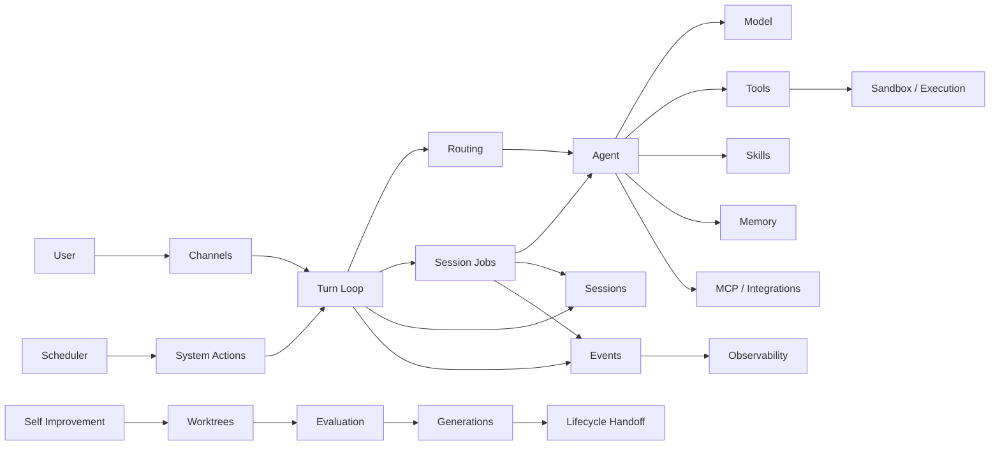

<p align="center">
  
</p>

<h1 align="center">F.R.I.D.A.Y</h1>

<p align="center">
  <strong>A self-hosted personal AI assistant that can remember, plan, automate, code, communicate, schedule, use tools and integrations, recover from interruptions, and extend its capabilities over time.</strong>
</p>

<p align="center">
  <a href="https://github.com/saravanaspar/F.R.I.D.A.Y/actions/workflows/ci.yml"></a>
  <a href="https://github.com/saravanaspar/F.R.I.D.A.Y/releases"></a>
  <a href="LICENSE"></a>
  
  <a href="CONTRIBUTING.md"></a>
</p>

<p align="center">
  <a href="#quick-start">Quick start</a> &middot;
  <a href="#what-friday-can-do">Capabilities</a> &middot;
  <a href="#how-it-fits-together">Architecture</a> &middot;
  <a href="#channels">Channels</a> &middot;
  <a href="#durability-and-recovery">Recovery</a> &middot;
  <a href="#development">Development</a>
</p>

---

## Meet F.R.I.D.A.Y

F.R.I.D.A.Y is designed to behave less like a one-shot chatbot and more like a long-lived assistant that stays useful across projects, devices, sessions, and restarts.

It combines a plugin-first agent runtime with durable sessions and background jobs, persistent memory, scheduling, multi-channel messaging, secure tool execution, MCP integrations, encrypted secrets, observability, and a verified self-improvement/restart path.

You can talk to the same assistant from a configured messaging channel, give it work that takes time, continue doing something else, come back later, schedule future work in your own timezone, or ask it to extend a missing capability when the runtime can safely build and verify one.

> [!IMPORTANT]
> F.R.I.D.A.Y can execute code, invoke tools, communicate with external services, and mutate files when permitted. Treat it like powerful local automation software: review permissions, use sandboxing where appropriate, protect credentials, and do not expose trusted channels to untrusted users.

## What F.R.I.D.A.Y can do

| Capability | What it means |
| --- | --- |
| Personal assistant | Maintains useful context across conversations, sessions, projects, and durable memory. |
| Long-running work | Runs persistent session jobs without forcing one conversation to wait for another task. |
| Coding and automation | Uses execution tools, files, processes, sandboxes, integrations, and model-driven workflows. |
| Multi-channel access | Receives and replies through Telegram, Discord, Slack, WhatsApp, Signal, Email, Teams, Google Chat, and SMS/Twilio. |
| Scheduling | Stores durable one-shot and recurring schedules in the user's configured IANA timezone. |
| Memory | Keeps bounded preferences, habits, and graph-like relationships without stuffing the full history into every prompt. |
| Skills | Installs and creates reusable skills that can be surfaced to the agent when relevant. |
| MCP and integrations | Connects external tools and services through permission-gated capability boundaries. |
| Secure secrets | Stores credentials in an encrypted Vault instead of plaintext runtime configuration. |
| Sandboxed execution | Supports rootless Podman isolation and a private Python execution environment. |
| Crash recovery | Writes secret-redacted crash records and supports supervised automatic restart. |
| Self-extension | Can feasibility-check, build, evaluate, promote, restart, and resume after adding a missing software capability. |

<details>
<summary><strong>What "self-extension" means</strong></summary>

F.R.I.D.A.Y does not blindly rewrite itself after every conversation. When an explicitly requested capability is missing, the self-improvement path can:

1. determine whether the capability is feasible;
2. request the required authorization;
3. create changes in an isolated worktree;
4. run quality/evaluation gates;
5. promote a verified generation;
6. perform an authenticated two-process handoff; and
7. resume the original request after the successor is ready.

If other foreground turns or background jobs are active at restart time, F.R.I.D.A.Y asks before pausing them and explains the recovery boundary.

</details>

## Quick start

### Install the latest release

On Linux or macOS:

```bash
curl -fsSL https://raw.githubusercontent.com/saravanaspar/F.R.I.D.A.Y/main/scripts/install-release.sh \
  | sh -s -- saravanaspar/F.R.I.D.A.Y
```

The installer supports **Linux and macOS** on x64/arm64, downloads the matching GitHub Release asset into a private unpredictable temporary directory, verifies its SHA-256 checksum, and installs `friday` into `~/.local/bin` by default.

Then run:

```bash
friday setup
friday
```

On Windows, the supported path is **WSL2** rather than an unsafe native build. From PowerShell, download and run the WSL installer wrapper:

```powershell
$installer = Join-Path $env:TEMP "friday-install.ps1"
Invoke-WebRequest https://raw.githubusercontent.com/saravanaspar/F.R.I.D.A.Y/main/scripts/install-release.ps1 -OutFile $installer
& $installer
Remove-Item $installer
```

That installs the hardened Linux binary inside your default WSL2 distribution. Enter WSL2 and run `friday setup`, or invoke it from PowerShell with `wsl sh -lc '$HOME/.local/bin/friday setup'`.

> [!NOTE]
> The release installer requires a published GitHub Release for the requested platform. Native Windows release binaries are intentionally not published yet: F.R.I.D.A.Y relies on POSIX private-file permissions in security-sensitive state paths. The PowerShell installer uses WSL2 so those guarantees remain intact until equivalent native Windows ACL enforcement and tests exist.

### Build from source

Requirements:

> On a Windows host, build and run F.R.I.D.A.Y inside **WSL2**. Native Windows execution is not yet a supported hardened security boundary.

- Node.js **22.22.2** and npm for the release-equivalent toolchain (`.node-version` pins this exact build runtime);
- Git;
- at least one supported ingress channel and one explicitly confirmed exact operator identity during first-run setup;
- credentials for the model provider you select, when required.

```bash
git clone https://github.com/saravanaspar/F.R.I.D.A.Y.git
cd F.R.I.D.A.Y
npm ci
npm run friday -- setup
npm run friday
```

To build the standalone executable for the current host:

```bash
npm ci
npm run build:binary
./build/binary/friday setup
./build/binary/friday
```

## First-run setup

The normal installed flow is intentionally small:

```bash
friday setup
friday
```

On the first setup, F.R.I.D.A.Y requires:

1. a main model;
2. provider credentials when the selected provider requires them;
3. your IANA wall-clock timezone, for example `Asia/Kolkata`;
4. at least **one enabled ingress channel** with one explicitly confirmed exact operator identity.

Runtime defaults are not published until first-run channel setup and exact operator pairing are complete. `allowAll` may widen transport admission, but it never creates an operator implicitly. Secrets are validated and stored in Vault rather than written to `runtime.env`.

Useful setup commands:

```bash
friday setup
friday setup --timezone Asia/Kolkata
friday setup sandbox
friday setup execution-python
friday setup self-repository /path/to/F.R.I.D.A.Y
friday setup whatsapp
friday setup --help
```

MCP servers, skills, personas, and other plugin-owned capabilities are normally managed conversationally through a trusted configured channel.

### Optional host capabilities

The core assistant does not silently install privileged host software. Enable only the capabilities you need:

| Capability | Host requirement | Notes |
| --- | --- | --- |
| Private execution Python | `uv` **or** Python 3.11 | Provision with `friday setup execution-python`; the environment pins the kernel dependencies exactly. |
| Rootless coding sandbox | Rootless Podman | Build the local image with `friday setup sandbox`. Sandbox internet is blocked by default and network-bearing commands require an explicit request/permission approval. |
| Self-improvement from source | Git + npm + a clean F.R.I.D.A.Y checkout | Save the canonical checkout with `friday setup self-repository /path/to/F.R.I.D.A.Y`. Release-binary self-improvement builds, verifies, stages, and hands off to a new host-native binary before activation. |
| WhatsApp bridge | npm/Node tooling | Provision bridge dependencies with `friday setup whatsapp`. |

Run `friday doctor` at any time for a sectioned installation, configuration, security, tooling, and recovery report. Every actionable warning/error includes a one-line repair guide. Doctor is non-interactive by default, does not make outbound network calls, and never reads plaintext Vault secrets. Use `friday doctor --fix` only when you want guided, confirmed repairs for deterministic fixes, or `friday doctor --json` for machine-readable diagnostics.

## Channels

F.R.I.D.A.Y routes human messaging through a common trusted channel boundary while keeping provider-specific transport logic isolated.

| Channel | Ingress | Egress | Approval UI | Media ingress |
| --- | :---: | :---: | --- | --- |
| Telegram | Yes | Yes | Native buttons + text code | Retrieved |
| Discord | Yes | Yes | Native buttons + text code | Retrieved |
| Slack | Yes | Yes | Native buttons + text code | Safe notice only |
| WhatsApp | Yes | Yes | Text code | Safe notice only |
| Signal | Yes | Yes | Text code | Safe notice only |
| Email | Yes | Yes | Text code | Safe notice only |
| Microsoft Teams | Yes | Yes | Adaptive Card buttons + text code | Safe notice only |
| Google Chat | Yes | Yes | Card buttons + text code | Safe notice only |
| SMS / Twilio | Yes | Yes | Text code | Safe notice only |

Network channels default toward explicit identity/access configuration. Protected approvals, credential capture, trusted prompts, and cancellation codes are intercepted before ordinary routing/model use and scoped to the exact channel/account/conversation/sender/thread principal. Protected state is persisted privately so a restart rejects stale replies and callback replays instead of routing them as new user requests. Unsupported media is admitted as an explicit safe notice with no unusable attachment handle.

Email identity is derived from the parsed `From` address; F.R.I.D.A.Y does not currently evaluate mailbox `Authentication-Results`. Grant privileged Email authority only when the receiving mailbox or upstream gateway reliably enforces anti-spoofing policy.

The `friday` runtime does not read terminal conversation input and registers no CLI channel. The command line is reserved for setup/onboarding compatibility, doctor, and bounded stopped-runtime maintenance.

## How it fits together



The key design rule is separation of authority: model-facing plugins do not automatically receive trusted secrets, lifecycle authority, or raw transport privileges. Composition happens through typed capabilities and contributions instead of a single central command registry.

<details>
<summary><strong>Core subsystems</strong></summary>

- **Agent** - model/tool orchestration and bounded autonomous continuation.
- **Turn Loop** - durable inbound turn lifecycle and result replay.
- **Sessions** - persistent transcripts and context/compaction ownership.
- **Session Jobs** - detached durable work with per-session serialization.
- **Memory** - SQLite hybrid search plus bounded preference/relationship memory.
- **Scheduler** - durable one-shot and recurring work with leases and retries.
- **Channels** - trusted ingress/egress adapters and protected interactions.
- **Execution / Sandbox** - process supervision, Python kernel execution, and rootless isolation.
- **Vault** - authenticated encrypted secret persistence.
- **Permissions** - effect-aware authorization for reads, writes, credentials, network, and system changes.
- **Self Improvement** - candidate worktrees, evaluation, generations, promotion, rollback, and verified restart handoff.
- **Events / Audit / Observability** - operational delivery, tamper-evident audit data, logs, metrics, and model usage telemetry.

</details>

## Durability and recovery

### Durable inbound messages

Channel messages are durably admitted before transports acknowledge them. If reply delivery fails after work already completed, a provider retry can replay the recorded result rather than blindly executing the same turn again.

### Background jobs

Persistent Agent work can be admitted as a durable Session Job. Jobs retain the originating request, status/progress, and session association so separate sessions can progress concurrently while a single session remains serialized.

### Restart-aware continuation

Before self-improvement, capability installation, or a settings change performs a restart, F.R.I.D.A.Y checks for other active foreground turns and background jobs.

If work is active, the originating trusted user is warned that:

- transcript content and tool output already persisted remain available;
- unrecorded private model thinking/progress may be lost;
- paused durable jobs resume from the last recorded transcript plus the original request; and
- the request that initiated the restart resumes in its original conversation after verified takeover.

A random environment variable is not enough to authorize a second runtime. Process overlap is restricted to a successor that proves the lifecycle handoff identity.

### Crash logging and automatic restart

Catchable fatal failures are secret-redacted and synchronously recorded under:

```text
~/.friday/logs/crashes.ndjson
```

A hard `SIGKILL`, some OOM kills, or total host failure can still prevent application-level logging, so supervisor/system logs remain important.

For always-on Linux installations, an example systemd user unit is included:

```bash
mkdir -p ~/.config/systemd/user
cp deploy/systemd/friday.service ~/.config/systemd/user/friday.service
systemctl --user daemon-reload
systemctl --user enable --now friday
journalctl --user -u friday -f
```

See [`docs/operations/ALWAYS_ON.md`](docs/operations/ALWAYS_ON.md) for the supported process lifecycle and restart model.

## Scheduling and timezone behavior

`FRIDAY_TIMEZONE` is a validated IANA timezone and is the authoritative wall-clock zone for user schedules.

Recurring cron schedules keep the intended local wall-clock phase through restarts, daylight-saving transitions, sleep, and downtime. One-shot schedules are persisted as absolute timestamps. The scheduler compares durable `nextRunAt` values to the current clock rather than depending on an in-memory countdown.

Change timezone with:

```bash
friday setup --timezone Europe/London
```

## Security model

F.R.I.D.A.Y is built around explicit trust boundaries rather than assuming the model is a trusted administrator.

- Vault secrets are encrypted at rest and model-facing code does not receive raw master-key access.
- Channel principals carry trusted identity metadata separate from model text.
- Permissions classify effects such as external reads/writes, credential writes, and system mutations.
- Rootless sandbox execution is available for model-generated work; outbound internet is **off by default** and a command must explicitly request network access, which then follows the normal permission/approval path back to the originating trusted channel.
- Session, scheduler, job, generation, and event persistence fail closed on malformed or unsafe state in security-sensitive paths.
- Audit and observability are separated from execution authority.

For vulnerability reporting, see [`SECURITY.md`](SECURITY.md).

> [!WARNING]
> Sandboxing and permissions reduce risk; they do not make arbitrary generated code intrinsically safe. Run F.R.I.D.A.Y under a dedicated user account when practical, keep trusted channel access narrow, and review the capabilities you enable.

## Memory and model usage

F.R.I.D.A.Y stores explicit preferences and repeated relationship/object facts as bounded memory rather than continuously replaying the entire conversation history.

Model usage can be inspected through a trusted channel with requests such as:

```text
show model usage
show detailed model usage
```

Usage can be attributed by session, root/parent agent, subagent, and detached job. Provider-reported billing data is kept distinct from catalog-derived estimates.

## Backup and recovery

Stop the runtime before full-state backup or restore. For any backup that can leave the machine, use encrypted mode:

```bash
friday backup create --encrypt
friday backup list
friday backup verify BACKUP_ID
friday backup restore BACKUP_ID --yes
```

Encrypted backups use a per-backup scrypt-derived key, AES-256-GCM authenticated encryption for every file, and a keyed manifest authentication code. The passphrase is read from a hidden terminal; automation may use `FRIDAY_BACKUP_PASSPHRASE`. Unencrypted backups remain supported for local compatibility, but they may contain plaintext transcripts, memory, scheduler data, and operational state.

Vault recovery uses a separate passphrase-encrypted recovery kit:

```bash
friday vault recovery create --out /safe/location/friday-vault.recovery
friday vault recovery restore --in /safe/location/friday-vault.recovery
```

The passphrase is read from a hidden terminal. For automation, use `FRIDAY_VAULT_RECOVERY_PASSPHRASE`; recovery passphrases are not accepted as command-line arguments.

## Releases

Normal pushes and pull requests run verification but do not publish binaries. Releases are generated only when a version tag is pushed after the release commit has reached protected `main`. Development work should use a focused short-lived branch, merge through a PR, and delete the branch after merge.

F.R.I.D.A.Y intentionally uses a small custom numeric tag format rather than SemVer: each `MAJOR.MINOR.PATCH` component accepts **1-6 digits**. Major/minor are integer-normalized. The patch component is decimal-style for release identity: trailing zeroes do not create a new release, while leading zeroes preserve precision.

```text
v0.1.1      == v0.1.10 == v0.1.100000
v2.3.04     == v2.3.040
v2.3.04     != v2.3.4
v2.3.00004  != v2.3.04
```

The release workflow rejects a tag if an equivalent canonical identity already exists. For the current release line, create the release tag only after the intended commit is merged to and synced with `main`:

```bash
git switch main
git pull --ff-only origin main
# Releases are created manually from GitHub Actions.
# Actions -> Release -> Run workflow
# Branch: main
# Enter the desired release version, for example: 0.1.0
```

Release builds currently target Linux x64/arm64 and macOS x64/arm64 and use the pinned Node.js 22.22.2 SEA-compatible runtime. Every published binary embeds the exact release tag version, is accompanied by its SHA-256 checksum, and is published alongside `SHA256SUMS` and an SPDX SBOM. The workflow also emits GitHub build-provenance attestations for the four binaries and SBOM. Windows release binaries are deliberately disabled until F.R.I.D.A.Y has native Windows ACL enforcement for private state and a Windows-specific security test matrix.

With a recent GitHub CLI, a downloaded release artifact can additionally be checked against its repository provenance:

```bash
gh attestation verify ./friday-linux-x64 --repo saravanaspar/F.R.I.D.A.Y
```

## Development

### Verify the repository

```bash
npm ci
npm run setup:execution-python
npm run verify
```

Useful targeted commands:

```bash
npm run typecheck
npm test
npm run test:workspaces
npm run check:architecture
npm run check:packaging
npm run check:silent-failures
npm run check:models
```

The root verification gate checks architecture boundaries, packaging discovery, TypeScript, silent-failure policy, generated model metadata, root tests, and workspace tests.

### Contributing

Contributions are welcome. Start with [`CONTRIBUTING.md`](CONTRIBUTING.md), follow the [`CODE_OF_CONDUCT.md`](CODE_OF_CONDUCT.md), and use the issue/PR templates so changes arrive with enough context to review safely.

Useful project documents:

- [`CONTRIBUTING.md`](CONTRIBUTING.md) - development workflow and architecture expectations.
- [`SECURITY.md`](SECURITY.md) - private vulnerability reporting and security scope.
- [`SUPPORT.md`](SUPPORT.md) - where to ask for help or report bugs.
- [`CHANGELOG.md`](CHANGELOG.md) - notable user-facing changes.
- [`ACKNOWLEDGEMENTS.md`](ACKNOWLEDGEMENTS.md) - upstream inspiration, adapted components, and license provenance.
- [`docs/architecture/`](docs/architecture/) - architecture contracts and ADRs.
- [`docs/PLUGIN_DEVELOPMENT.md`](docs/PLUGIN_DEVELOPMENT.md) - minimal plugin-authoring path, capability boundaries, permissions, secrets, lifecycle, and tests.

## Project status

F.R.I.D.A.Y is under active development. Interfaces, setup flows, plugin contracts, and state formats may evolve while the project matures. Back up important state before upgrading and read release notes before deploying a new generation to an always-on installation.

## License

F.R.I.D.A.Y is distributed under the [MIT License](LICENSE). Portions of the implementation and design have upstream open-source lineage; retained notices and a human-readable provenance summary are in [`ACKNOWLEDGEMENTS.md`](ACKNOWLEDGEMENTS.md).

---

<p align="center"><sub>Open-source lineage: selected ideas and implementation details were adapted from the MIT-licensed <a href="https://github.com/NousResearch/hermes-agent">Hermes Agent</a>, <a href="https://github.com/PrimeIntellect-ai/prime-agent">Prime Agent</a> / Pi lineage, and <a href="https://github.com/anomalyco/opencode">OpenCode</a>, then integrated into F.R.I.D.A.Y's plugin/capability architecture. F.R.I.D.A.Y is an independent project and is not affiliated with or endorsed by those projects. See <a href="ACKNOWLEDGEMENTS.md">Acknowledgements</a>.</sub></p>
